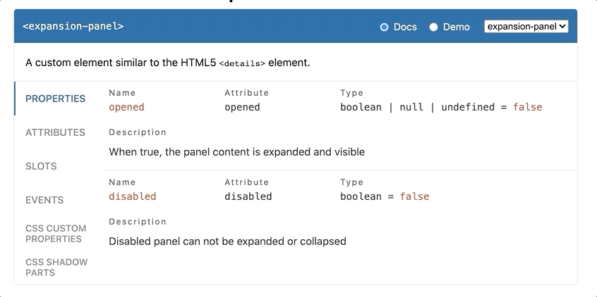

# Introducing Custom Elements Manifest

The idea for a `web-components.json` was first suggested in
this [GitHub issue](https://github.com/w3c/webcomponents/issues/776) on the web components GitHub repository, by Pine from the VS Code team, with the initial goal for IDEs to be able to better support custom elements.


Developers tend to have many differing opinions, and standardization tends to... take time. More than 3 years later, we are happy to finally be able to share with you: _Custom Elements Manifest_ 🎉

Custom Elements Manifest is a file format that describes the custom elements in your project. This format will allow tooling and IDEs to give rich information about the custom elements in a given project. A `custom-elements.json` contains metadata about the custom elements in your project; their properties, methods, attributes, inheritance, slots, CSS Shadow Parts, CSS custom properties, and a modules exports. If you're interested in following the specification of the schema, or contributing to it, you can find the repository here: [webcomponents/custom-elements-manifest](https://github.com/webcomponents/custom-elements-manifest).

## Example

Here's an example:

```js
class MyElement extends HTMLElement {
  static get observedAttributes() {
    return ['disabled'];
  }

  set disabled(val) {
    this.__disabled = val;
  }
  get disabled() {
    return this.__disabled;
  }

  fire() {
    this.dispatchEvent(new Event('disabled-changed'));
  }
}

customElements.define('my-element', MyElement);
```


Will result in the following `custom-elements.json`:

```json
{
  "schemaVersion": "1.0.0",
  "readme": "",
  "modules": [
    {
      "kind": "javascript-module",
      "path": "fixtures/-default/package/my-element.js",
      "declarations": [
        {
          "kind": "class",
          "description": "",
          "name": "MyElement",
          "members": [
            {
              "kind": "field",
              "name": "disabled"
            },
            {
              "kind": "method",
              "name": "fire"
            }
          ],
          "events": [
            {
              "name": "disabled-changed",
              "type": {
                "text": "Event"
              }
            }
          ],
          "attributes": [
            {
              "name": "disabled"
            }
          ],
          "superclass": {
            "name": "HTMLElement"
          },
          "tagName": "my-element"
        }
      ],
      "exports": [
        {
          "kind": "custom-element-definition",
          "name": "my-element",
          "declaration": {
            "name": "MyElement",
            "module": "fixtures/-default/package/my-element.js"
          }
        }
      ]
    }
  ]
}
```

## Potential Usecases

Why Custom Elements Manifest?

### Documentation and demos

Documentation viewers should be able to display all the relevant information about a custom element, such as its tag name, attributes, properties, definition module, CSS variables and parts, etc.



> [`api-viewer-element`](https://github.com/web-padawan/api-viewer-element) by [Serhii Kulykov](https://twitter.com/serhiikulykov)

Using a `custom-elements.json` file, it would be easy to generate or display demos for your component using tools such as [api-viewer-element](https://github.com/web-padawan/api-viewer-element), or automatically generate [Storybook](https://storybook.js.org/) knobs for your components. [11ty](https://www.11ty.dev/) plugins could be created to automatically create your documentation sites for you.

### Framework Integration

React currently is the only major framework where [custom elements require some special handling](https://custom-elements-everywhere.com/). React will pass all data to a custom element in the form of HTML attributes, and cannot listen for DOM events coming from Custom Elements without the use of a workaround.

The solution for this is to create a wrapper React component that handles these things. Using a `custom-elements.json` file, creation of these wrapper components could be automated.

Some component libraries like [Fast](http://fast.design/) or [Shoelace](https://shoelace.style/) provide specific instructions on how to integrate with certain frameworks. Automating this integration layer could make development easier for both authors of component libraries, but also for consumers of libraries.

### Avoiding breaking API changes in minor or patch versions

Another interesting usecase, inspired by [`elm-package`](https://github.com/elm-lang/elm-package#elm-package), is that tooling could be able to detect whether or not the public API of a custom element has changed, based on a snapshot of the current `custom-elements.json` file to decide the impact of an update, and potentially prevent breaking API change in patch or minor versions.

### Linting

Linters will be able to give accurate contextual information about your custom element. Are you setting an attribute on a custom element that is not supported? Are you adding an event listener to a custom element that it doesn't fire? With the use of `custom-elements.json`, linters will be able to warn you, and catch mistakes early.

### Cataloging

A major usecase of `custom-elements.json` is that it allows us to reliably detect NPM packages that for certain contain custom elements. These packages could be stored, and displayed on a custom elements catalog, effectively a potential reboot of webcomponents.org. This catalog would be able to show rich demos and documentation of the custom elements contained in a package, by importing its components from a CDN like unpkg, and its `custom-elements.json` file.

### Much, much more!

We believe `custom-elements.json` will open the door for a lot, lot more new exciting ideas and tooling. Which usecases can _you_ come up with? Do you have an idea, but are unsure where to start? Feel free to reach out to us on the [Lit and Friends](https://lit.dev/slack-invite) slack, we're always happy to have a chat and help you get started.

## How should I use a Custom Elements Manifest?

If you're publishing a component, or a library of components, we recommend people to create a Custom Elements Manifest and publish it alongside your components to NPM.

If your package makes use of [Export Maps](https://nodejs.org/api/packages.html#packages_exports), make sure to add your Custom Elements Manifest there under the `"customElements"` key. This will allow consumers of your manifest to easily import it like so:

```js
import cem from '@my-element/customElements' assert { type: 'json' };
```

If your package does not use Export Maps yet, we recommend adding a `"customElements": "./custom-elements.json"` to your project's `package.json`. This allows tools to easily find whether or not a package contains a Custom Elements Manifest, and read its contents.

## 🛠 The Tools

It's unlikely that developers will write their `custom-elements.json` file by hand. So at [Open Web Components](http://open-wc.org/), we worked hard on a tool that does it for you!

## `@custom-elements-manifest/analyzer`

[`@custom-elements-manifest/analyzer`](https://www.npmjs.com/package/@custom-elements-manifest/analyzer) will scan the source files in your project, and generate a `custom-elements.json` for you.

Here's how you can use it today:

```bash
npx custom-elements-json analyze
```

> ✨ Or try it out in the [online playground](https://custom-elements-manifest.netlify.app/)! ✨


`@custom-elements-manifest/analyzer` by default supports standard JavaScript, and _vanilla_ web components. Dedicated web component libraries can be supported through the use of plugins. Currently, support for LitElement, Fast, Stencil and Catalyst is provided in this project via plugins. You can enable them by using the CLI flags `--litelement`, `--fast`, `--stencil` and `--catalyst` respectively, or loading the plugin via your `custom-elements-manifest.config.js`.

**TL;DR:** 
- JavaScript 
- TypeScript
- [LitElement](https://lit.dev) (opt-in via CLI flag) 
- [FASTElement](https://www.fast.design/docs/fast-element/getting-started/) (opt-in via CLI flag) 
- [Stencil](https://stenciljs.com/) (opt-in via CLI flag)
- [Catalyst](https://github.github.io/catalyst/) (opt-in via CLI flag)
- [Atomico](https://atomicojs.github.io/) (opt-in via [community plugin](https://github.com/atomicojs/custom-elements-manifest))

Support for other web component libraries can be done via custom [plugins](https://github.com/open-wc/custom-elements-manifest/blob/master/packages/analyzer/docs/plugins.md), feel free to create your own for your favourite libraries.

### Plugins

Different projects often have different requirements, and ways of documenting their components. Do you need to support custom JSDoc? Custom Decorators? Custom libraries? Custom anything? `@custom-elements-manifest/analyzer` has a rich plugin system that allows you to extend its functionality, and add whatever extra metadata you need to your `custom-elements.json`.

A plugin usually is a function that returns an object, and has several hooks you can opt in to:

- **collectPhase**: First passthrough through the AST of all modules in a project, before continuing to the `analyzePhase`. Runs for each module, and gives access to a Context object that you can use for sharing data between phases, and gives access to the AST nodes of your source code. This is useful for collecting information you may need access to in a later phase.
- **analyzePhase**: Runs for each module, and gives access to the current Module's moduleDoc, and gives access to the AST nodes of your source code. This is generally used for AST stuff.
- **moduleLinkPhase**: Runs after a module is done analyzing, all information about your module should now be available. You can use this hook to stitch pieces of information together.
- **packageLinkPhase**: Runs after all modules are done analyzing, and after post-processing. All information should now be available and linked together.

> **TIP:** When writing custom plugins, [ASTExplorer](https://astexplorer.net/#/gist/f99a9fba2c21e015d0a8590d291523e5/cce02565e487b584c943d317241991f19b105f94) is your friend 🙂

Let's take a look at an example plugin:

Imagine we have some sourcecode, with a custom `@foo` JSDoc annotation and some information that we'd like to add to our `custom-elements.json`:

`my-element.js`:
```js
export class MyElement extends HTMLElement {
  /**
   * @foo Some custom information!
   */ 
  message = ''
}
```

In a custom plugin, we have full access to our source code's AST, and we can easily loop through any members of a class, and see if it has a JSDoc tag with the name `foo`. If it does, we add the description to our `custom-elements.json`:

`custom-elements-manifest.config.js`:
```js
export default {
  plugins: [
    {
      // Always give your plugin a name!
      name: 'foo-plugin',
      // Runs for all modules in a project, before continuing to the `analyzePhase`
      collectPhase({ts, node, context}){},
      // Runs for each module
      analyzePhase({ts, node, moduleDoc, context}){
        // You can use this phase to access a module's AST nodes and mutate the custom-elements-manifest
        switch (node.kind) {
          case ts.SyntaxKind.ClassDeclaration:
            const className = node.name.getText();

            node.members?.forEach(member => {
              const memberName = member.name.getText();

              member.jsDoc?.forEach(jsDoc => {
                jsDoc.tags?.forEach(tag => {
                  if(tag.tagName.getText() === 'foo') {
                    const description = tag.comment;

                    const classDeclaration = moduleDoc.declarations.find(declaration => declaration.name === className);
                    const messageField = classDeclaration.members.find(member => member.name === memberName);
                    
                    messageField.foo = description
                  }
                });
              });
            });
        }
      },
      // Runs for each module, after analyzing, all information about your module should now be available
      moduleLinkPhase({moduleDoc, context}){},
      // Runs after modules have been parsed and after post-processing
      packageLinkPhase({customElementsManifest, context}){},
    }
  ]  
}
```

And the output `custom-elements.json` will look like this:
```diff
{
  "schemaVersion": "0.1.0",
  "readme": "",
  "modules": [
    {
      "kind": "javascript-module",
      "path": "fixtures/-default/package/bar.js",
      "declarations": [
        {
          "kind": "class",
          "description": "",
          "name": "MyElement",
          "members": [
            {
              "kind": "field",
              "name": "message",
              "default": "",
+             "foo": "Some custom information!"
            }
          ],
          "superclass": {
            "name": "HTMLElement"
          },
          "customElement": true
        }
      ],
      "exports": [
        {
          "kind": "js",
          "name": "MyElement",
          "declaration": {
            "name": "MyElement",
            "module": "fixtures/-default/package/bar.js"
          }
        }
      ]
    }
  ]
}
```

To get started developing custom plugins, take a look at the [cem-plugin-template](https://github.com/open-wc/cem-plugin-template) repository to quickly get you up and running. 

## Concluding

We're excited and look forward to see what sorts of tooling you'll build with the Custom Elements Manifest. Do you have a cool idea, but are you unsure how to get started? Drop by the [Lit and Friends](https://lit.dev/slack-invite) slack!